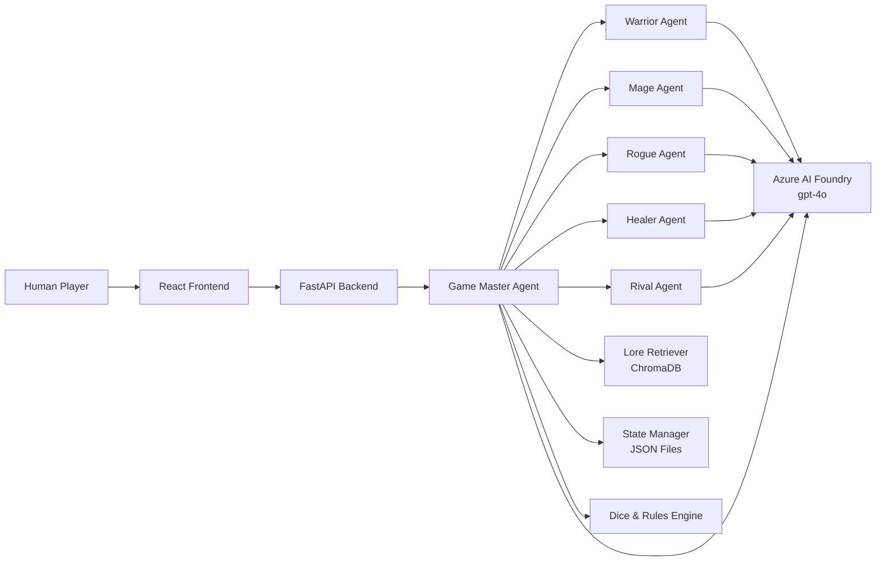
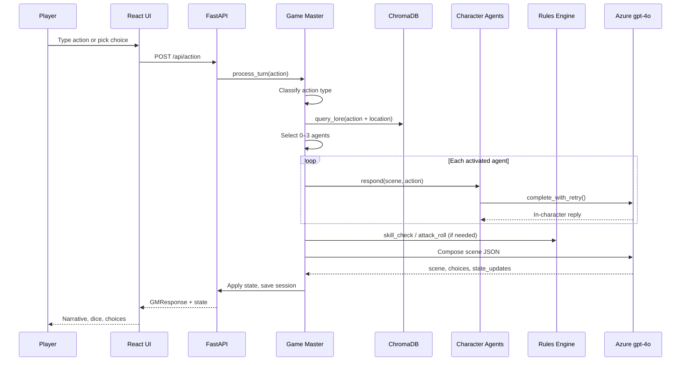

# The Shattered Moon of Eldervale — Multi-Agent Fantasy RPG

## Overview

**The Shattered Moon of Eldervale** is a turn-based, multi-agent fantasy role-playing game where you type natural-language actions and a **Game Master (GM) Agent** orchestrates the story. Five AI character agents—Warrior, Mage, Rogue, Healer, and Rival—respond in-character with persistent stats, backstories, and party dynamics.

You are not chatting with a single bot. Each turn, the GM classifies your action, pulls relevant world lore from a **ChromaDB** knowledge base, activates the right companions, runs dice checks through a pure-Python rules engine, and composes a unified narrative scene with choices for what to do next.

The stack is a **FastAPI** backend, a **React + Vite + TypeScript** dark-fantasy chat UI, JSON file persistence for campaign state, and **Azure AI Foundry** (`gpt-4o` via `azure-ai-inference`) for all narrative intelligence.


### What makes it different

| Feature | Description |
|---------|-------------|
| Multi-agent orchestration | GM delegates to specialized character agents per turn |
| Grounded lore | ChromaDB RAG over markdown world files at runtime |
| Fair mechanics | Deterministic dice/rules engine separate from LLM narration |
| Persistent campaigns | Session state saved to JSON; resume across visits |
| Irreversible choices | Opening the Moonlit Gate, killing NPCs, etc. require confirmation |

---

## Architecture



### Turn flow (high level)



---

## Multi-Agent Design

The GM is the **orchestrator**. Character agents are **specialists** invoked when the action context calls for them. All agents share the same Azure model (`gpt-4o`) but use distinct system prompts, personalities, and backstories.

| Agent | Character | Role | Personality | When activated |
|-------|-----------|------|-------------|----------------|
| **Game Master** | Narrator | Orchestrator, rules arbiter, scene composer | Dark, mysterious, fair | Every turn |
| **Warrior** | Bran Ironvale | Combat, protection, danger calls | Brave, blunt, loyal | Combat, exploration |
| **Mage** | Lyra Vey | Arcana, lore interpretation | Analytical, arrogant | Investigation, magic keywords |
| **Rogue** | Sable Dusk | Scouting, secrets, wit | Witty, skeptical | Exploration, social, investigation |
| **Healer** | Aldric Thorn | Healing, morality, diplomacy | Compassionate, principled | Combat, social, heal keywords |
| **Rival** | Kael Thorn | Dramatic tension, deals | Charismatic, threatening | Kael/rival/thorn keywords |

### Agent selection logic

The GM classifies each player action into one of: `combat`, `social`, `investigation`, `rest`, `inventory`, or `exploration`. Base agent picks follow the action type; keyword overrides can add Mage, Healer, or Rival. At most **3 agents** activate per turn.

| Action type | Default agents |
|-------------|----------------|
| Combat | Warrior, Healer |
| Social | Healer, Rogue |
| Investigation | Mage, Rogue |
| Exploration | Rogue, Warrior |
| Other | Warrior |

**Keyword overrides:** `magic`, `rune`, `arcane` → Mage; `heal`, `wound` → Healer; `kael`, `rival`, `thorn` → Rival.

### Modules each layer uses

| Layer | Modules |
|-------|---------|
| Game Master | `lore_retriever`, `rules`, `state_manager`, all character agents, `base_agent.complete_with_retry` |
| Character agents | `base_agent.complete_with_retry` only |
| Rules engine | `dice`, `rules` (pure Python, no LLM) |
| Lore | ChromaDB + `sentence-transformers` (`all-MiniLM-L6-v2`) |

---

## Tech Stack

### Backend

| Technology | Purpose |
|------------|---------|
| **Python 3.11+** | Runtime |
| **FastAPI** | REST API (`/api/new-game`, `/api/action`, etc.) |
| **Uvicorn** | ASGI server |
| **Azure AI Inference SDK** | Chat completions against Foundry `gpt-4o` |
| **ChromaDB** | Vector store for lore RAG |
| **sentence-transformers** | Local embeddings (`all-MiniLM-L6-v2`) |
| **Pydantic** | Request/response validation |
| **python-dotenv** | Environment configuration |

### Frontend

| Technology | Purpose |
|------------|---------|
| **React 18** | UI framework |
| **TypeScript** | Type-safe components and hooks |
| **Vite** | Dev server and production build |
| **Tailwind CSS** | Dark-fantasy styling |
| **react-markdown** | Render GM narrative (Markdown) |

### AI & data

| Component | Details |
|-----------|---------|
| **LLM** | `gpt-4o` via Azure AI Foundry |
| **Lore source** | Markdown files in `backend/data/lore/` |
| **State persistence** | JSON files in `backend/data/state/` |
| **Embeddings** | Local; no external embedding API |

### API surface

| Endpoint | Method | Description |
|----------|--------|-------------|
| `/api/new-game` | POST | Create campaign + opening scene |
| `/api/action` | POST | Process player action through GM loop |
| `/api/confirm` | POST | Confirm/cancel irreversible actions |
| `/api/state/{session_id}` | GET | Full campaign state |
| `/api/rest` | POST | Short or long rest |
| `/api/lore/search` | GET | Debug lore retrieval |
| `/health` | GET | Health check |

---

## Game Rules & How to Play

### Getting started

1. run locally.
2. Enter your **adventurer name**.
3. Choose a **class**: Warrior, Mage, Rogue, or Healer (this is your player character; NPC companions join automatically).
4. Read the opening scene at **The Moonlit Gate**.
5. Type what you want to do in plain English, or tap a numbered **choice chip**.
6. Watch **dice rolls**, **party HP**, and the **agent trace** panel to see which AI agents spoke this turn.
7. Use **Short Rest** / **Long Rest** from the header when you need to recover HP.

### Core abilities

Six ability scores, range **1–20**:

| Ability | Typical use |
|---------|-------------|
| **STR** | Melee attacks, Athletics |
| **DEX** | Stealth, finesse weapons, initiative |
| **INT** | Arcana, History |
| **WIS** | Perception, Medicine, Insight |
| **CON** | HP, short-rest healing |
| **CHA** | Persuasion, Deception, Intimidation |

**Modifier** = `floor((score - 10) / 2)` — e.g. STR 18 → +4.

### Checks & outcomes

Roll **d20 + modifier** vs a **Difficulty Class (DC)**:

| Result | Condition |
|--------|-----------|
| **Critical success** | Total ≥ DC + 5 |
| **Success** | Total ≥ DC |
| **Partial success** | Total ≥ DC − 4 (usually costs something) |
| **Failure** | Below partial threshold |

### Skills (ability mapping)

| Skill | Ability |
|-------|---------|
| Stealth | DEX |
| Arcana, History | INT |
| Medicine, Perception, Insight | WIS |
| Persuasion, Deception, Intimidation | CHA |
| Athletics | STR |

### Combat

1. **Initiative:** d20 + DEX modifier (highest acts first).
2. **Attack:** d20 + STR or DEX (weapon-dependent) vs target **AC**.
3. **Damage:** weapon die + modifier (e.g. longsword = d8 + STR).
4. **Critical hit:** beat AC by 5+ → double damage dice.
5. **0 HP** = incapacitated. Combat ends when all enemies or all party members are down.

Example weapons: longsword (d8+STR), dagger (d4+DEX), shortbow (d6+DEX), rapier (d8+DEX).

### Inventory

- **8 slots** maximum per character.
- **Light** = 1 slot, **Medium** = 2, **Heavy** = 3.
- Cannot pick up items if slots are full.

### Resting

| Rest type | Effect |
|-----------|--------|
| **Short rest** | Once between long rests: recover **d6 + CON modifier** HP per party member |
| **Long rest** | Full HP restore; resets short rest; requires a safe location |

Conditions (poisoned, frightened) persist through short rest unless cured.

### Irreversible actions

The GM pauses for confirmation before actions like:

- Opening the **Moonlit Gate**
- **Killing** a named NPC
- Using a **cursed artifact**
- **Destroying** a relic
- **Betrayal**

You will see *"This cannot be undone. Do you wish to proceed?"* — answer **Yes** or **No**.

### Tips for good play

- Be specific: *"Examine the runes on the gate"* beats *"look around"*.
- Talk to companions by name — that can activate the right agent.
- Check the **Quest Journal** and **Party Panel** for HP, inventory, and active quests.
- Partial successes still move the story forward — expect complications.

---

## How Agents Work (In Detail)

### 1. Shared Azure client (`base_agent.py`)

All agents call **`complete_with_retry()`**, which:

1. Resolves the Azure AI Foundry **deployment endpoint** (auto-discovers chat deployments or uses `AZURE_AI_INFERENCE_ENDPOINT`).
2. Builds a message list: **system prompt** + last **10** conversation turns + **user prompt**.
3. Calls `ChatCompletionsClient.complete()` with `gpt-4o`, `max_tokens`, and `temperature`.
4. Retries with exponential backoff on rate limits (401/404 fail fast with clear errors).

```python
# Simplified call pattern (every agent uses this)
complete_with_retry(
    system_prompt=AGENT_SYSTEM_PROMPT,
    user_prompt=scene + player_action + gm_instruction,
    conversation_history=state["conversation_history"],
    max_tokens=256,   # 1500 for GM
    temperature=0.8,
)
```

### 2. Character agent pattern

Each character agent (e.g. `WarriorAgent`) is a small class:

- **`__init__(state)`** — holds campaign state reference and a fixed **in-character system prompt** (backstory, voice, tactical role).
- **`respond(scene_context, player_action, gm_instruction, conversation_history)`** — formats a user prompt and returns the LLM reply string.

The GM never lets character agents write final scene JSON. They only produce **quoted dialogue / reactions** that the GM weaves into the narrative.

### 3. Game Master orchestration (`game_master.py`)

**`GameMaster.process_turn(player_action, confirmed=False)`** runs the full loop:

| Step | What happens |
|------|----------------|
| 1. Confirmation gate | If action matches irreversible keywords and not confirmed → return confirmation prompt |
| 2. Classify | `_classify_action()` → combat / social / investigation / etc. |
| 3. Lore RAG | `_build_lore_context()` → ChromaDB query on action + location + quest |
| 4. Select agents | `_select_agents()` → up to 3 agent keys |
| 5. Agent calls | For each key: instantiate from `AGENT_MAP`, call `.respond()` |
| 6. Dice | `_needs_roll()` → `rules.skill_check()` or `rules.attack_roll()` when keywords/action type match |
| 7. GM synthesis | JSON payload sent to Azure with lore, agent replies, rolls, and state snapshot |
| 8. Parse & persist | Parse GM JSON, `apply_state_updates()`, increment turn, append conversation history |

**`AGENT_MAP`:**

```python
AGENT_MAP = {
    "warrior": WarriorAgent,
    "mage": MageAgent,
    "rogue": RogueAgent,
    "healer": HealerAgent,
    "rival": RivalAgent,
}
```

### 4. GM output schema

The GM must return JSON like:

```json
{
  "scene": "Markdown narrative...",
  "choices": ["1. ...", "2. ...", "3. ..."],
  "rolls": [],
  "state_updates": {
    "location": null,
    "world_flags": {},
    "party_hp_changes": {},
    "inventory_changes": {},
    "quest_updates": [],
    "faction_reputation": {},
    "rival_trust_level": null
  },
  "agents_activated": ["warrior", "mage"],
  "lore_chunks_used": ["locations::moonlit_gate::0"],
  "requires_confirmation": false,
  "confirmation_prompt": null
}
```

### 5. How the frontend calls agents (indirectly)

The React app never talks to agents directly. **`useGameSession`** hook:

| User action | HTTP call | Backend |
|-------------|-----------|---------|
| Start game | `POST /api/new-game` | `new_campaign()` → `GameMaster.opening_scene()` |
| Send message | `POST /api/action` | `GameMaster.process_turn(action)` |
| Confirm danger | `POST /api/confirm` | `process_turn(pending_action, confirmed=True)` |
| Resume | `GET /api/state/{id}` | `load_session()` from localStorage |
| Rest | `POST /api/rest` | `rules.short_rest()` or full HP restore |

Session ID is stored in **`localStorage`** (`eldervale_session_id`) so refresh resumes your campaign.

### 6. Lore retrieval (`lore_retriever.py`)

On backend startup:

1. Parse all `backend/data/lore/*.md` at `##` headings into chunks.
2. Embed with `all-MiniLM-L6-v2`.
3. Store in ChromaDB collection `eldervale_lore`.

At runtime, `query_lore(query, n_results=4)` returns the top chunks for the GM prompt — keeping narration consistent with world files (locations, factions, quests, bestiary, etc.).

### 7. State management (`state_manager.py`)

- **`new_campaign(player_name, character_class)`** — UUID session, party from templates, rival NPC, starting location, empty conversation history.
- **`save_session` / `load_session`** — one JSON file per `session_id`.
- **`apply_state_updates`** — merges GM `state_updates` into live state (HP, inventory, quests, flags).

---
## Running Locally

### Prerequisites

- Python 3.11+
- Node.js 18+
- Azure AI Foundry project with **gpt-4o** deployed

### Backend

```bash
cd backend
python -m venv venv
# Windows: venv\Scripts\activate
# macOS/Linux: source venv/bin/activate
pip install -r requirements.txt
cp ../.env.example ../.env
# Add AZURE_AI_FOUNDRY_API_KEY and AZURE_AI_FOUNDRY_ENDPOINT
uvicorn main:app --reload --port 8000
```

### Frontend

```bash
cd frontend
npm install
npm run dev
```

Open [http://localhost:5173](http://localhost:5173). The Vite dev proxy forwards `/api` to port 8000.

### Environment variables

| Variable | Required | Description |
|----------|----------|-------------|
| `AZURE_AI_FOUNDRY_API_KEY` | Yes | Foundry project API key |
| `AZURE_AI_FOUNDRY_ENDPOINT` | Yes | Foundry project endpoint URL |
| `AZURE_AI_MODEL` | No | Default `gpt-4o` |
| `AZURE_AI_DEPLOYMENT_NAME` | No | Override deployment name |
| `CHROMA_PERSIST_DIR` | No | ChromaDB path |
| `STATE_DIR` | No | Campaign JSON directory |
| `LORE_DIR` | No | Lore markdown source |

---
## License

MIT
