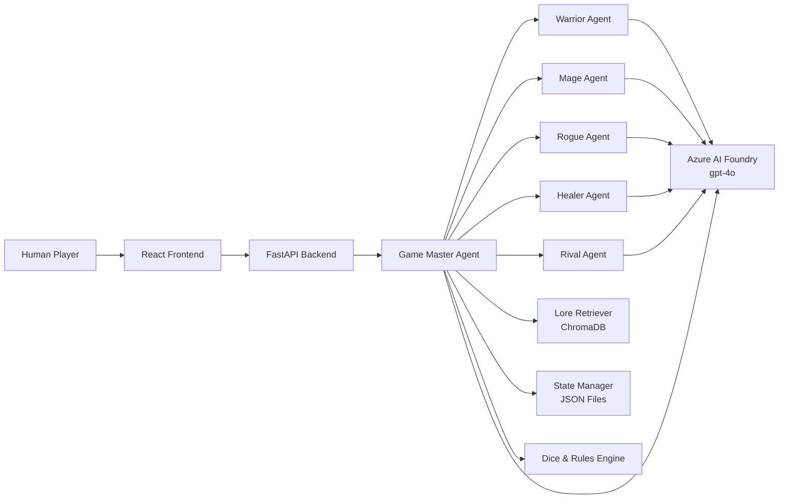

# The Shattered Moon of Eldervale — Multi-Agent Fantasy RPG

## Overview

**The Shattered Moon of Eldervale** is a turn-based, multi-agent fantasy role-playing game where a human player types natural-language actions and a **Game Master (GM) Agent** orchestrates the adventure. Five character agents—Warrior, Mage, Rogue, Healer, and Rival—respond in-character with persistent stats, backstories, and interpersonal dynamics. World lore is grounded in a local **ChromaDB** knowledge base queried at runtime, while all narrative intelligence runs on **Azure AI Foundry** via the `azure-ai-inference` SDK and **gpt-4o**.

The project combines a **FastAPI** backend, **React + Vite + TypeScript** frontend with a dark-fantasy chat UI, JSON file persistence, and a pure-Python dice/rules engine.

## Architecture Diagram



## Multi-Agent Design

| Agent | Role | Personality | Modules accessed | Azure model used |
|-------|------|-------------|------------------|------------------|
| Game Master | Orchestrator, narrator, rules arbiter | Dark, mysterious, fair | lore_retriever, rules, state_manager, all agents | gpt-4o |
| Warrior (Bran Ironvale) | Combat, protection | Brave, blunt, loyal | base_agent | gpt-4o |
| Mage (Lyra Vey) | Arcana, lore interpretation | Analytical, arrogant | base_agent | gpt-4o |
| Rogue (Sable Dusk) | Scouting, secrets | Witty, skeptical | base_agent | gpt-4o |
| Healer (Aldric Thorn) | Healing, morality | Compassionate, principled | base_agent | gpt-4o |
| Rival (Kael Thorn) | Dramatic tension, deals | Charismatic, threatening | base_agent | gpt-4o |

## Prerequisites

- Python 3.11+
- Node.js 18+
- npm 9+
- An Azure AI Foundry project with gpt-4o deployed

## Azure AI Foundry Setup

1. Go to [https://ai.azure.com](https://ai.azure.com)
2. Open your project (`nandu-3153-resource`)
3. Copy the **Project endpoint** URL
4. Copy the **API key** from the dashboard
5. Verify **gpt-4o** is deployed under "Models + endpoints"
6. Paste both into your `.env` file (see below)

## API Keys and Credentials Required

| Variable | Where to find it | Required? |
|----------|------------------|-----------|
| `AZURE_AI_FOUNDRY_API_KEY` | Azure AI Foundry dashboard → API key | **Required** |
| `AZURE_AI_FOUNDRY_ENDPOINT` | Azure AI Foundry dashboard → Project endpoint | **Required** |
| `AZURE_AI_MODEL` | Your deployed model name (default: `gpt-4o`) | Optional |
| `AZURE_OPENAI_ENDPOINT` | Azure OpenAI endpoint (reference only) | Optional |

## Installation

### 1. Clone the repository

```bash
git clone <repo-url>
cd rpg-multiagent
```

### 2. Backend setup

```bash
cd backend
python -m venv venv
source venv/bin/activate        # Windows: venv\Scripts\activate
pip install -r requirements.txt
cp ../.env.example ../.env
# Edit .env — add AZURE_AI_FOUNDRY_API_KEY and your project endpoint
```

### 3. Frontend setup

```bash
cd ../frontend
npm install
```

## Running the Project

### Start the backend

```bash
cd backend
source venv/bin/activate        # Windows: venv\Scripts\activate
uvicorn main:app --reload --port 8000
```

On first run, the lore knowledge base is automatically indexed (~30 seconds).

To force re-indexing:

```bash
uvicorn main:app --reload --port 8000 -- --reindex
```

### Start the frontend

```bash
cd frontend
npm run dev
```

Open [http://localhost:5173](http://localhost:5173)

## API Reference

### POST /api/new-game

Creates a new campaign with an opening scene.

**Request:**
```json
{
  "player_name": "Alden",
  "character_class": "warrior"
}
```

`character_class` must be one of: `warrior`, `mage`, `rogue`, `healer`.

**Response:**
```json
{
  "session_id": "uuid",
  "scene": "Markdown narrative...",
  "choices": ["1. ...", "2. ..."],
  "state": { "...": "..." }
}
```

**Example:**
```bash
curl -X POST http://localhost:8000/api/new-game \
  -H "Content-Type: application/json" \
  -d '{"player_name":"Alden","character_class":"warrior"}'
```

### POST /api/action

Processes a player action through the GM orchestration loop.

**Request:**
```json
{
  "session_id": "uuid",
  "action": "Examine the Moonlit Gate"
}
```

**Response:** Full GM output JSON including `scene`, `choices`, `rolls`, `state_updates`, `agents_activated`, `lore_chunks_used`, `requires_confirmation`, and `state`.

**Example:**
```bash
curl -X POST http://localhost:8000/api/action \
  -H "Content-Type: application/json" \
  -d '{"session_id":"<uuid>","action":"Scout the perimeter"}'
```

### POST /api/confirm

Confirms or cancels a pending irreversible action.

**Request:**
```json
{
  "session_id": "uuid",
  "confirmed": true
}
```

**Example:**
```bash
curl -X POST http://localhost:8000/api/confirm \
  -H "Content-Type: application/json" \
  -d '{"session_id":"<uuid>","confirmed":true}'
```

### GET /api/state/{session_id}

Returns the full current campaign state.

**Example:**
```bash
curl http://localhost:8000/api/state/<uuid>
```

### GET /api/lore/search?q={query}

Queries the ChromaDB lore retriever directly (debug endpoint).

**Example:**
```bash
curl "http://localhost:8000/api/lore/search?q=Starwell+Relic"
```

### POST /api/rest

Triggers a short or long rest for the party.

**Request:**
```json
{
  "session_id": "uuid",
  "rest_type": "short"
}
```

**Example:**
```bash
curl -X POST http://localhost:8000/api/rest \
  -H "Content-Type: application/json" \
  -d '{"session_id":"<uuid>","rest_type":"long"}'
```

## Game Rules Summary

- **Ability scores:** STR, DEX, INT, WIS, CON, CHA (1–20). Modifier = `floor((score - 10) / 2)`.
- **Checks:** d20 + modifier vs DC. Critical success (DC+5), success (DC), partial success (DC−4), failure below.
- **Combat:** Initiative (d20+DEX), attack (d20+STR/DEX vs AC), weapon damage (e.g. longsword d8+STR). 0 HP = incapacitated.
- **Inventory:** 8 slots max. Light=1, Medium=2, Heavy=3 slots per item.
- **Rests:** Short rest = d6+CON HP once between long rests. Long rest = full HP in safe location.
- **Skills:** Stealth→DEX, Arcana→INT, Medicine→WIS, Persuasion→CHA, Athletics→STR, Perception→WIS, Deception→CHA, History→INT, Insight→WIS, Intimidation→CHA.

## Directory Structure

```
rpg-multiagent/
├── backend/
│   ├── main.py                 # FastAPI entry point
│   ├── agents/                 # GM + character agents
│   ├── engine/                 # dice, rules, state, lore
│   ├── data/
│   │   ├── lore/               # Markdown world knowledge
│   │   ├── state/              # Session JSON files
│   │   └── chroma/             # ChromaDB persistence (auto-created)
│   ├── utils/
│   └── requirements.txt
├── frontend/
│   ├── src/
│   │   ├── components/         # UI components
│   │   ├── hooks/              # useGameSession
│   │   └── types/
│   └── package.json
├── .env.example
├── DECISIONS.md
└── README.md
```

## Environment Variables

| Variable | Default | Description | Required |
|----------|---------|-------------|----------|
| `AZURE_AI_FOUNDRY_API_KEY` | — | Foundry project API key | Yes |
| `AZURE_AI_FOUNDRY_ENDPOINT` | — | Foundry project endpoint URL | Yes |
| `AZURE_AI_MODEL` | `gpt-4o` | Deployed model name | No |
| `AZURE_OPENAI_ENDPOINT` | — | Reference OpenAI endpoint | No |
| `BACKEND_PORT` | `8000` | Backend port | No |
| `FRONTEND_PORT` | `5173` | Frontend dev port | No |
| `CHROMA_PERSIST_DIR` | `./backend/data/chroma` | ChromaDB storage | No |
| `STATE_DIR` | `./backend/data/state` | Campaign state files | No |
| `LORE_DIR` | `./backend/data/lore` | Lore markdown source | No |
| `LOG_LEVEL` | `INFO` | Logging verbosity | No |

## Lore Knowledge Base

On first startup, all `.md` files in `backend/data/lore/` are parsed at `##` headings, embedded with `all-MiniLM-L6-v2`, and stored in ChromaDB collection `eldervale_lore`.

- **Re-index:** Delete `backend/data/chroma` and restart, or run with `--reindex`.
- **Add lore:** Create a new markdown entry following the template in any lore file, then re-index.

## Agent System

1. Player submits an action via `/api/action`.
2. GM classifies the action (exploration, combat, social, etc.).
3. GM queries ChromaDB for relevant lore.
4. GM selects 0–3 character agents to activate based on context.
5. Each agent calls Azure AI Inference with its in-character system prompt.
6. Rules engine executes dice rolls when appropriate.
7. GM composes a unified JSON scene response and applies state updates.
8. Conversation history is appended and persisted to JSON.

## Troubleshooting

### "AZURE_AI_FOUNDRY_API_KEY not set"
Set it in your `.env` file. Copy the key from the Azure AI Foundry project dashboard under "API key".

### "401 Unauthorized from Azure"
Your API key is wrong or expired. Re-copy it from the dashboard.

### "404 Model not found"
Your `AZURE_AI_MODEL` value doesn't match a deployed model. Go to Azure AI Foundry → Models + endpoints and check the deployment name.

### "ChromaDB collection not found"
Delete `./backend/data/chroma` and restart the backend — it will re-index automatically.

### "Port 8000 already in use"

**Linux/macOS:**
```bash
lsof -i :8000 | grep LISTEN
kill -9 <PID>
```

**Windows (PowerShell):**
```powershell
netstat -ano | findstr :8000
taskkill /PID <PID> /F
```

### Frontend cannot reach backend
Check that the Vite proxy in `vite.config.ts` forwards `/api` to `http://localhost:8000`.

### Slow lore indexing on first run
`sentence-transformers` downloads the `all-MiniLM-L6-v2` model (~90MB) on first use. This is a one-time download.

## Extending the Project

- **New character agent:** Add `agents/new_agent.py`, register in `game_master.py` `AGENT_MAP`, add lore entry in `characters.md`, re-index.
- **New lore:** Add markdown entries under `backend/data/lore/`, re-index ChromaDB.
- **New rules:** Update `engine/rules.py` and `homebrew_rules.md`, re-index.

## License

MIT
